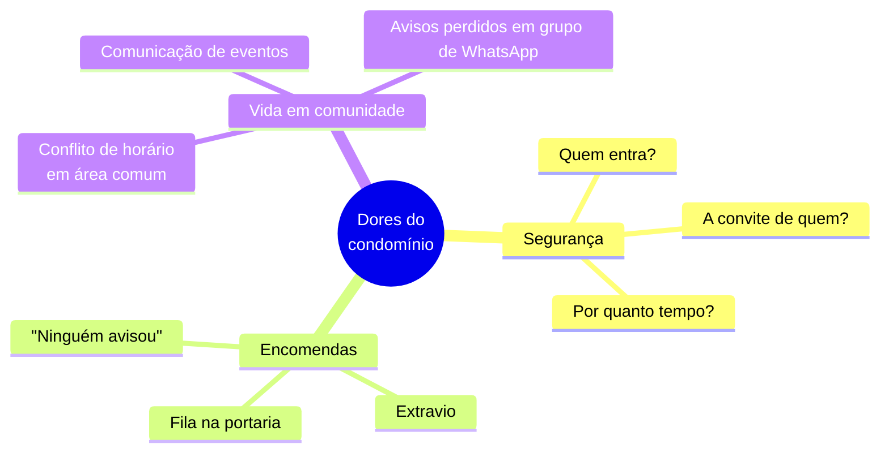
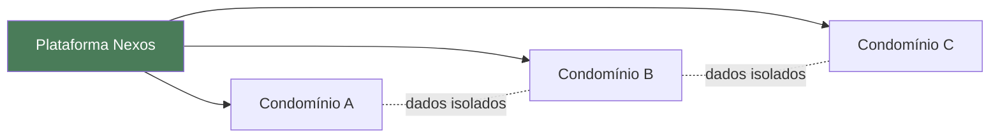

# 1. Visão Geral e Objetivo

⬅️ [[00 - Nexos (Início)]]

## Problema que resolve

Todo condomínio residencial enfrenta três dores operacionais recorrentes:

O **Nexos** ataca as três em um único painel, com um app dedicado para a portaria e um para o morador — a mesma aplicação, adaptada por papel de acesso.

## Modelo de negócio

**SaaS multi-tenant**: uma única instalação da plataforma atende a múltiplos condomínios, isolados entre si. Um operador de plataforma (Administrador) aprova a entrada de novos condomínios e mantém visão consolidada de toda a base — é o dono do produto, não de um condomínio específico.

Um detalhe de identidade relevante para o modelo comercial: **o mesmo e-mail pode existir em condomínios diferentes** — cenário real de síndicos profissionais que administram mais de um prédio. No login, se o e-mail existir em mais de um condomínio, o sistema apresenta uma tela de escolha de conta em vez de travar o acesso.

## Público-alvo

| Perfil | Quem é | O que busca no Nexos |
|---|---|---|
| **Administradora de condomínios** (cliente comercial) | Empresa que gerencia dezenas de prédios | Um painel único, multi-tenant, para toda a carteira |
| **Síndico (Gestor)** | Responsável por um condomínio | Visibilidade e controle sem depender só da portaria |
| **Portaria** | Time operacional do dia a dia | Ferramenta rápida para registrar e liberar acessos |
| **Morador** | Usuário final, mobile-first | Autoatendimento: acompanhar encomendas, autorizar visitas, reservar espaços |

## Proposta de valor por papel

- **Para quem vende o produto**: modelo SaaS escalável — um novo condomínio entra por um formulário de solicitação, sem trabalho manual de setup.
- **Para o síndico**: dashboard com indicadores operacionais (encomendas pendentes, visitantes ativos, reservas aguardando aprovação) em vez de planilhas soltas.
- **Para a portaria**: fluxo de trabalho guiado — cada ação (autorizar, registrar entrada, marcar retirada) é um botão, não uma ligação para o morador.
- **Para o morador**: app instalável (PWA) para resolver tudo do celular — autorizar visita, ver código da encomenda, reservar o salão de festas.

---
⬅️ [[00 - Nexos (Início)]] | ➡️ [[02 - Papéis e Permissões]]
