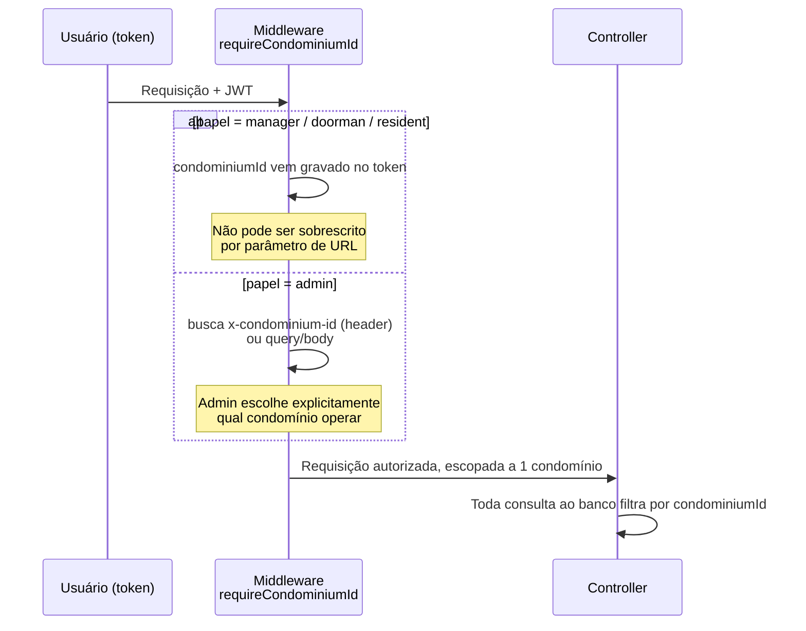

# 2. Papéis e Permissões

⬅️ [[00 - Nexos (Início)]]

O Nexos define **4 papéis** (`role` no banco de dados). O menu lateral e as rotas do front-end são derivados de uma única tabela de permissões — não existem "apps separados", é a mesma interface se adaptando.

```mermaid
graph TD
    ADMIN["👑 Administrador<br/>(plataforma)"] -->|aprova/rejeita| REQ[Solicitações de<br/>novo condomínio]
    ADMIN -->|enxerga tudo| ALL[Todos os condomínios<br/>e usuários]

    MANAGER["🏢 Gestor / Síndico<br/>(por condomínio)"] --> BLOCKS[Blocos e Residências]
    MANAGER --> STAFF[Equipe de Portaria]
    MANAGER --> APPROVE[Aprova reservas]
    MANAGER --> EVENTS_M[Cria eventos]

    DOORMAN["🛡️ Portaria"] --> VISITORS[Registra visitantes<br/>e controla entrada/saída]
    DOORMAN --> PACKAGES[Recebe e entrega<br/>encomendas]
    DOORMAN --> APPROVE

    RESIDENT["🏠 Morador"] --> MYVISITS[Autoriza seus<br/>próprios visitantes]
    RESIDENT --> MYPACK[Acompanha suas<br/>encomendas]
    RESIDENT --> BOOK[Reserva áreas comuns]
    RESIDENT --> RSVP[Curte e confirma<br/>presença em eventos]

    style ADMIN fill:#8b5cf6,color:#fff
    style MANAGER fill:#4a7c59,color:#fff
    style DOORMAN fill:#d97706,color:#fff
    style RESIDENT fill:#2563eb,color:#fff
```

## Matriz de acesso por módulo

| Módulo | Admin | Gestor | Portaria | Morador |
|---|:---:|:---:|:---:|:---:|
| Solicitações de condomínio | ✅ aprova | — | — | — |
| Condomínios (lista global) | ✅ | — | — | — |
| Usuários (lista global) | ✅ | — | — | — |
| Blocos | ✅* | ✅ | 👁️ | 👁️ |
| Residências | ✅* | ✅ | 👁️ | 👁️ (só a sua) |
| Moradores | ✅* | ✅ | 👁️ | — |
| Portaria (equipe) | ✅* | ✅ | — | — |
| Visitantes | ✅* | ✅ | ✅ | ✅ (só os seus) |
| Encomendas | ✅* | ✅ | ✅ | 👁️ (só as suas) |
| Áreas de Lazer (cadastro) | ✅* | ✅ | ✅ | 👁️ |
| Agendamentos (aprovação) | ✅* | ✅ | ✅ | cria + cancela os seus |
| Eventos (criação) | ✅* | ✅ | ✅ | curte + confirma presença |

`✅* ` = admin opera cross-tenant escolhendo explicitamente o condomínio-alvo.
`👁️` = somente leitura.

## Isolamento entre condomínios (multi-tenancy)

Praticamente toda tabela do banco carrega uma referência ao condomínio. O isolamento é garantido na camada de aplicação (cada consulta inclui `condominiumId`), não apenas na interface.

---
⬅️ [[01 - Visão Geral e Objetivo]] | ➡️ [[03 - Arquitetura Técnica]]
