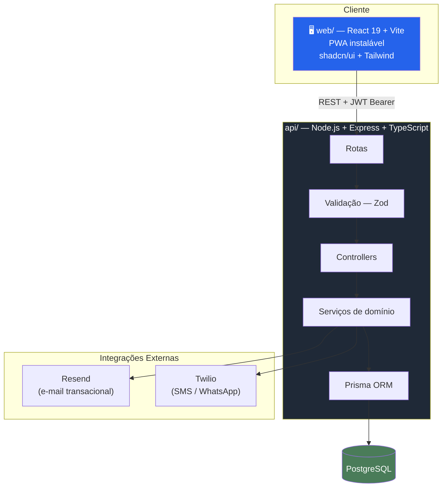
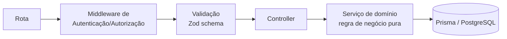

# 3. Arquitetura Técnica

⬅️ [[00 - Nexos (Início)]]

## Visão de alto nível

## Camadas do back-end

O código do `api/` segue uma separação clara de responsabilidades — cada request atravessa 5 camadas antes de tocar o banco:

Isso mantém a regra de negócio (ex.: "não pode reservar mais de 1 mês à frente") testável de forma isolada, fora do controller — vários módulos já têm testes automatizados (`.test.ts`) para essas regras.

## Stack resumida

| Camada | Tecnologias |
|---|---|
| **Front-end** | React 19, TypeScript, Vite, React Router 7, shadcn/ui (Radix), Tailwind CSS v4, React Hook Form + Zod, TanStack Query, Recharts, PWA |
| **Back-end** | Node.js, Express, TypeScript, Prisma ORM, Zod, JWT, bcrypt |
| **Banco de dados** | PostgreSQL (34+ migrações versionadas) |
| **E-mail transacional** | Resend (confirmação de conta, redefinição de senha, aprovação de condomínio) |
| **Notificação SMS/WhatsApp** | Twilio (código de retirada de encomenda), com fallback em console para ambientes sem provedor configurado |
| **Documentação de API** | Swagger (`/docs`) |
| **Testes** | Jest, cobrindo encomendas, reservas, visitantes e convites |

## Por que essas escolhas fazem sentido para o negócio

- **PWA mobile-first**: portaria e morador vivem no celular — instalar como app aumenta adoção sem passar por loja de apps.
- **Multi-tenant desde o schema**: crescer para novos condomínios não exige nova infraestrutura, apenas novo registro de `Condominium`.
- **Validação em camadas (Zod no front e no back)**: erros de formulário aparecem instantaneamente na tela, e são revalidados no servidor — nenhuma regra de negócio depende só do JavaScript do navegador.

---
⬅️ [[02 - Papéis e Permissões]] | ➡️ [[04 - Modelo de Dados]]
