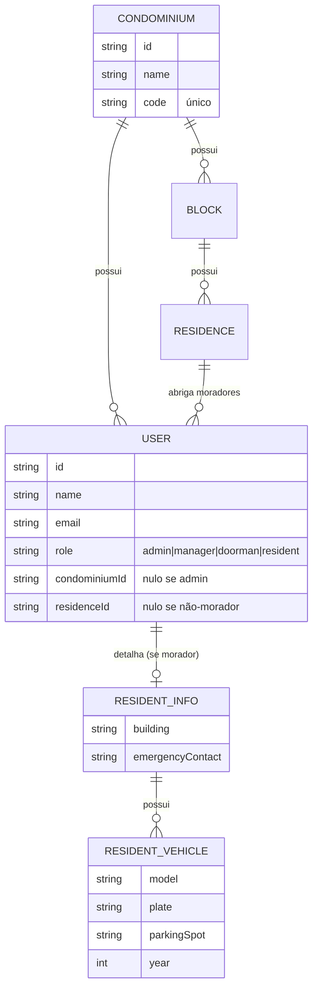
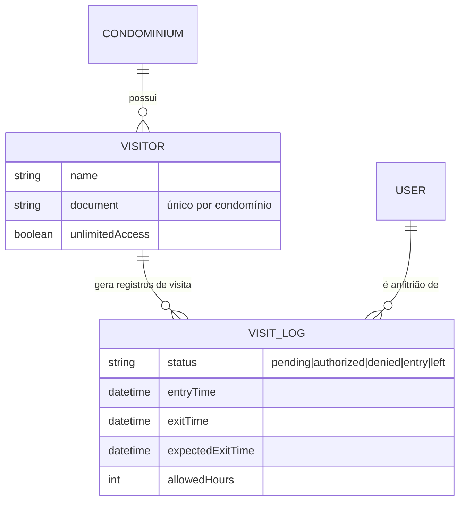
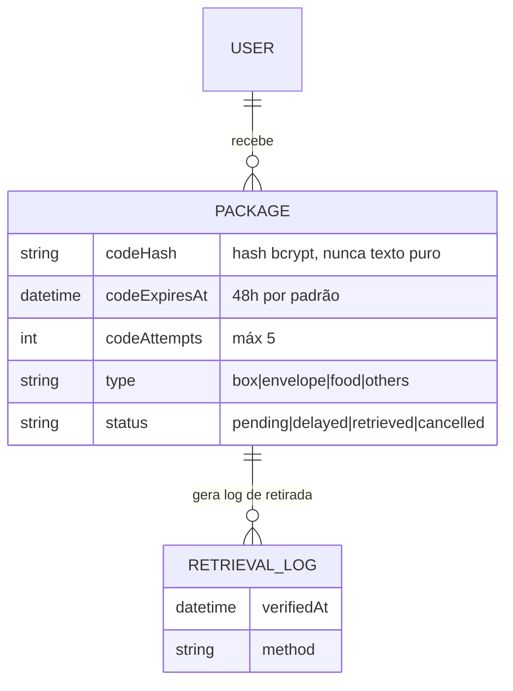
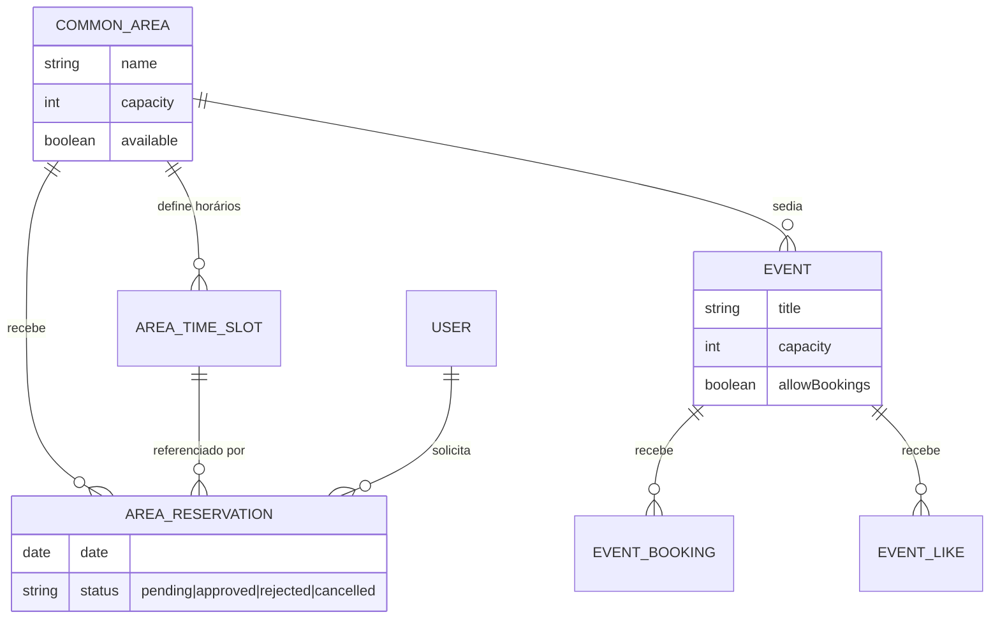
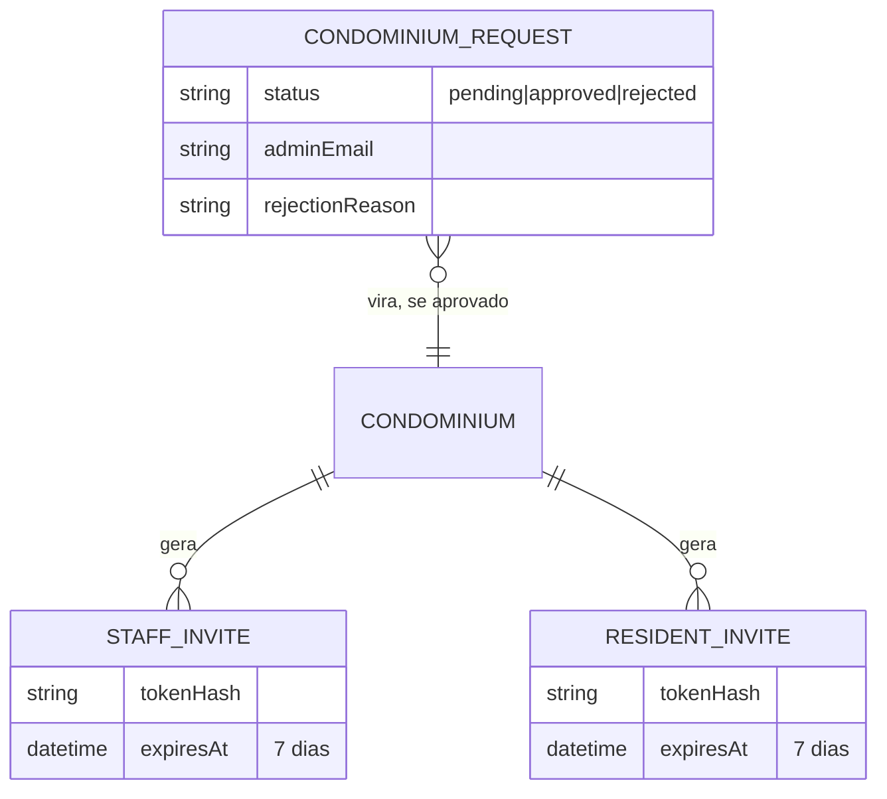

# 4. Modelo de Dados

⬅️ [[00 - Nexos (Início)]]

Extraído de `api/prisma/schema.prisma` — 26 modelos, todos (exceto os de nível plataforma) amarrados a um `Condominium` via `condominiumId`.

## Núcleo: estrutura física e pessoas

## Controle de acesso: visitantes

## Encomendas

## Áreas comuns, reservas e eventos

## Onboarding e convites (nível plataforma)

## Observação de design

Note que `User.condominiumId` é **opcional** — o único papel que fica com esse campo nulo é o `admin` de plataforma, exatamente porque ele não pertence a um único condomínio. Essa é a "costura" técnica que sustenta todo o modelo multi-tenant.

---
⬅️ [[03 - Arquitetura Técnica]] | ➡️ [[05 - Fluxos de Negócio]]
