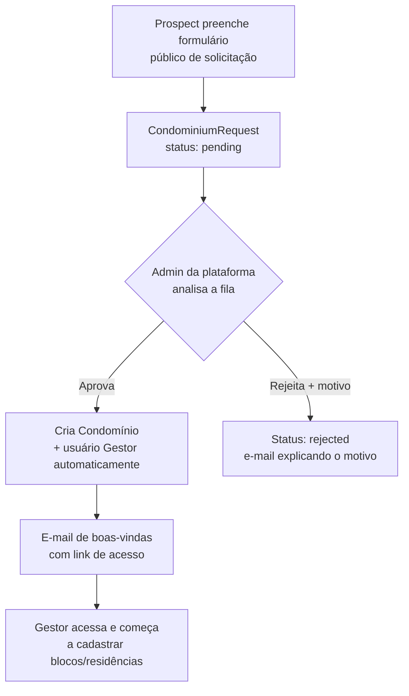
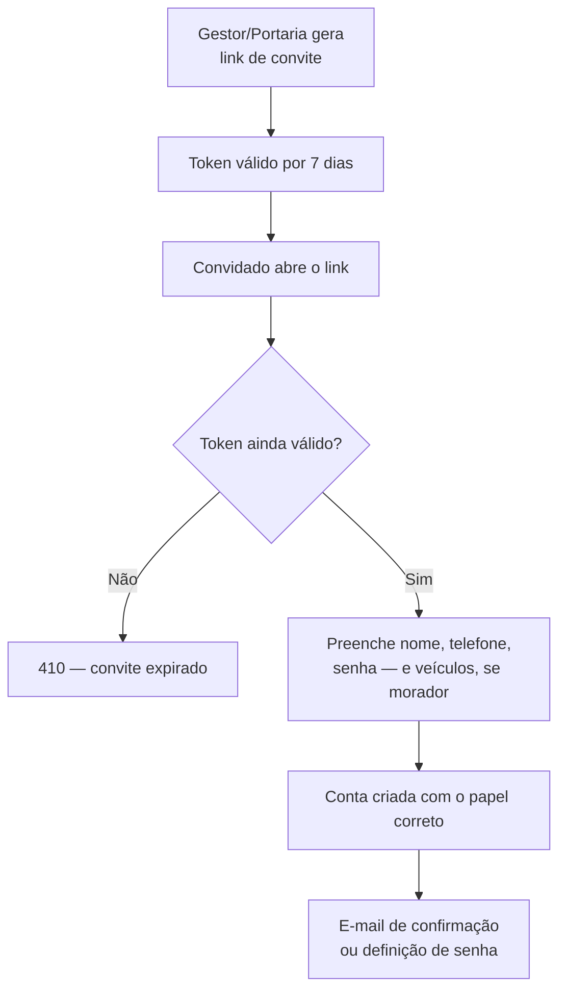
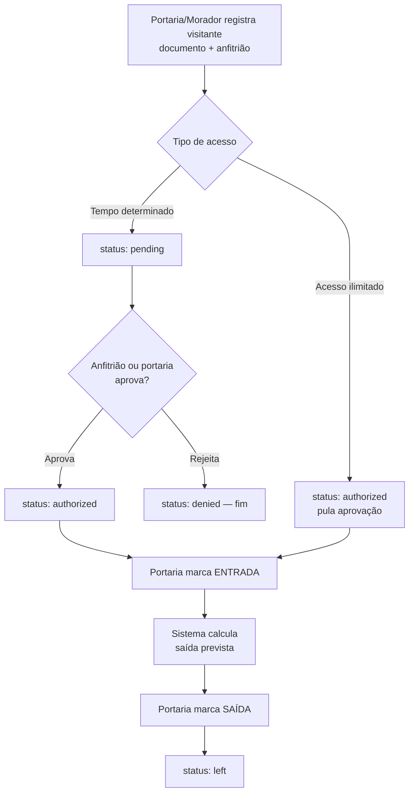
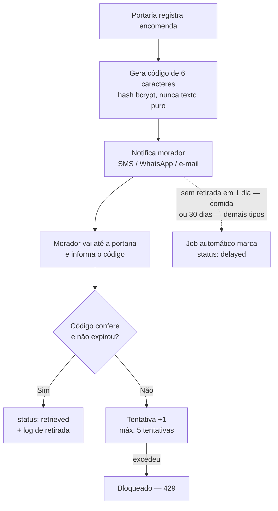
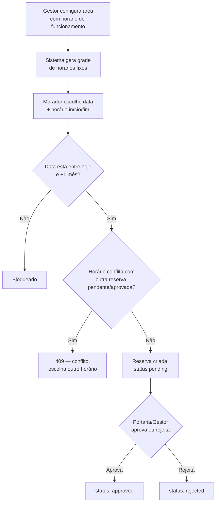
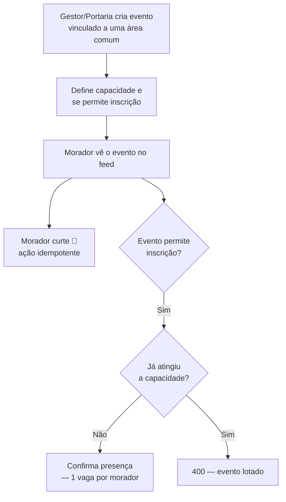

# 5. Fluxos de Negócio

⬅️ [[00 - Nexos (Início)]]

Os seis fluxos que sustentam a proposta de valor do Nexos, reconstruídos a partir do código de controllers, serviços e validadores.

## 5.1 Onboarding de um novo condomínio

## 5.2 Convite e cadastro de morador/porteiro

## 5.3 Visitante — do registro à saída

## 5.4 Encomenda — recebimento e retirada segura

## 5.5 Reserva de área comum — sem conflito de horário

## 5.6 Evento — criação, curtidas e confirmação de presença

---
⬅️ [[04 - Modelo de Dados]] | ➡️ [[06 - Tour pelo Produto (Galeria)]]
